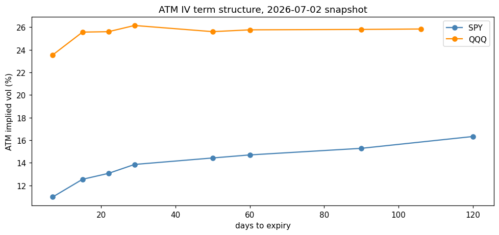
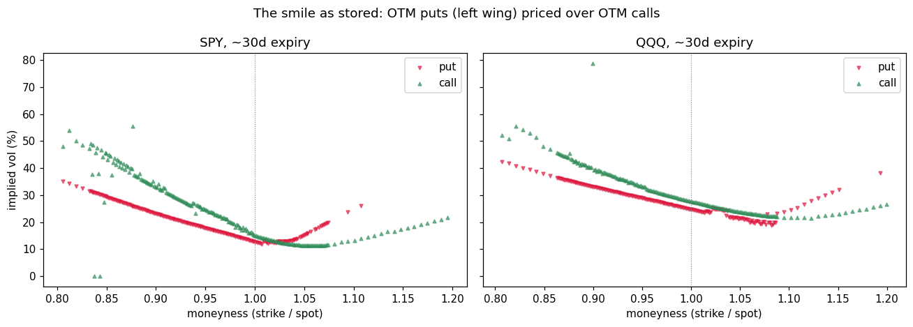

# options-data-pipeline

**Built a scheduled options-chain ETL — fetch, tidy, store, derive — because options
research dies on data logistics before it dies on ideas.** Historical chain data is
expensive; the free alternative is to start recording now. One command a day
accumulates the history that IV-rank signals and surface studies need, in a schema
designed to still make sense in six months. This is the infrastructure repo of the
portfolio: it exists to feed
[options-pricing-lib](https://github.com/dmitridefreitas-dev/options-pricing-lib)
(real smiles for the surface builder) and
[honest-backtester](https://github.com/dmitridefreitas-dev/honest-backtester)
(the IV-rank study that repo deferred for lack of exactly this data).

## Design rules

1. **One schema forever.** `tidy_chain` normalises every contract to one row —
   ticker, date, spot, expiry, DTE, type, strike, bid/ask/mid/last, IV, volume, OI,
   moneyness. Mid exists only when both quote sides are live; a one-sided quote never
   becomes a fake price; priceless contracts are dropped at the door.
2. **Append-only storage.** `<root>/<date>/<TICKER>.csv`, and saving onto an existing
   snapshot raises unless `overwrite=True` is said out loud. Market snapshots are
   facts about a moment; a store that can silently rewrite its past is not a research
   input.
3. **Pure, tested features.** ATM IV, term structure and slope, 95/105 skew, expected
   move (ATM straddle / spot), IV rank — every function is frame-in/number-out and
   tested against constructed chains with hand-known answers. 21 tests, no network.
4. **Target-DTE fetching.** Liquid ETFs now list *daily* expirations, so "first N
   expiries" collects two weeks of near-dated noise and no term structure (found the
   hard way: the first live run returned `term_slope = NaN`). The fetcher targets
   days-to-expiry (7…120) and takes the nearest distinct expiry to each.

## What a snapshot looks like

Live run, 2026-07-02 close (committed under `data/sample/` so the notebook and tests
reproduce offline — ~5,600 contracts):

| | SPY | QQQ |
|---|---|---|
| spot | 744.78 | 712.60 |
| 30d ATM IV | 13.9% | 26.2% |
| term slope (90d − 30d) | +1.4 pts (normal) | −0.4 pts (mildly inverted) |
| 95/105 skew | +6.4 pts | +5.1 pts |
| 30d expected move | 3.1% | 5.7% |
| IV rank | NaN — needs history, by design | NaN |





## Usage

```bash
pip install -e ".[dev]"
pytest                               # 21 tests, offline

optpipe snapshot --tickers SPY,QQQ   # fetch + store today's chains
optpipe list                         # inventory
optpipe features --ticker SPY        # latest features incl. IV rank over history
```

Schedule it — Windows Task Scheduler (this is the deployed setup: weekdays 5 PM
local, output appended to `data/snapshot.log`, and `-StartWhenAvailable` so a run
missed while the machine was off catches up on wake):

```powershell
$repo = "C:\path\to\options-data-pipeline"
$exe  = (Get-Command optpipe.exe).Source
$action  = New-ScheduledTaskAction -Execute cmd.exe `
    -Argument "/c `"`"$exe`" snapshot --tickers SPY,QQQ >> `"$repo\data\snapshot.log`" 2>&1`"" `
    -WorkingDirectory $repo
$trigger  = New-ScheduledTaskTrigger -Weekly -DaysOfWeek Monday,Tuesday,Wednesday,Thursday,Friday -At 5:00PM
$settings = New-ScheduledTaskSettingsSet -StartWhenAvailable -ExecutionTimeLimit (New-TimeSpan -Minutes 30)
Register-ScheduledTask -TaskName optpipe-daily-snapshot -Action $action -Trigger $trigger -Settings $settings
```

or cron: `0 17 * * 1-5 optpipe snapshot --tickers SPY,QQQ >> data/snapshot.log 2>&1`

Weekend and holiday runs fail loudly and harmlessly: the fetch resolves to the last
trading day, whose snapshot already exists, and the append-only store refuses the
duplicate — which is the store doing its job, not a bug.

```python
from optpipe import fetch_chain
from optpipe.store import save_snapshot, load_history
from optpipe.features import snapshot_features, iv_rank

chain = fetch_chain("SPY")            # tidy frame, one row per contract
save_snapshot(chain)                  # append-only
snapshot_features(chain)              # {'atm_iv_30d': 0.139, 'skew_30d': 0.064, ...}
```

## Limitations / what I'd do next

- **Delayed retail data.** yfinance quotes and IVs are indicative, not NBBO — fine
  for daily research features, unusable for microstructure. ITM wings show stale
  quotes (visible in the smile plot); downstream work should prefer OTM contracts.
- **IV rank needs patience by design** — it is NaN until the store accumulates
  history. Any shortcut is lookahead in disguise.
- **Next:** run the deferred IV-rank mean-reversion study in honest-backtester once
  ~6 months of snapshots exist; invert stored mids through options-pricing-lib's
  solver to cross-check yfinance's IVs; CSV → parquet when the store gets big enough
  to care.
